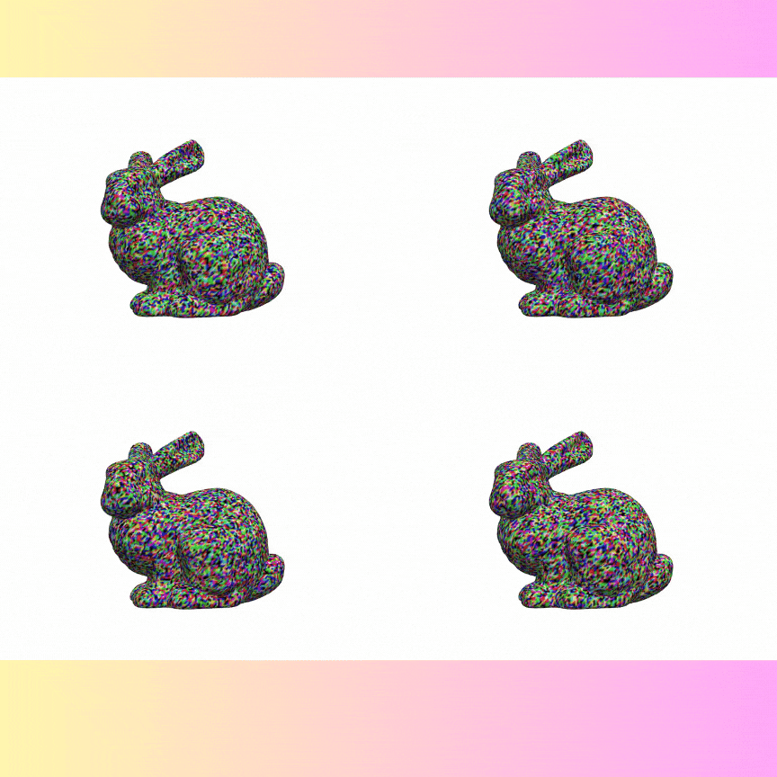

<h1>DoubleDiffusion </h1>
<h3>Combining Heat Diffusion:fire: with Denoising Diffusion    for Generative Learning on 3D Meshes</h3>

  

<a href="https://wxyxixixi.github.io/">Xuyang Wang</a>:kangaroo:, <a href="https://scholar.google.com/citations?user=1NIzHZcAAAAJ&hl=en">Ziang Cheng</a>:penguin:, <a href="https://zhyever.github.io/">Zhenyu Li</a>:camel:,  <a href="https://scholar.google.com.au/citations?user=xe6Uv3gAAAAJ&hl=en">Jiayu Yang</a>:penguin:,   <a href="https://scholar.google.com/citations?user=9BA3wgQAAAAJ&hl=en">Haorui Ji</a>:kangaroo:, <a href="https://panji530.github.io/">Pan Ji</a>:penguin:, <a href="https://sites.google.com/site/mehrtashharandi/">Mehrtash Harandi</a>:koala:,  <a href="https://scholar.google.com.au/citations?user=cHia5p0AAAAJ&hl=en">Richard Hartley</a>:kangaroo:,  <a href="https://users.cecs.anu.edu.au/~hongdong/">Hongdong Li</a>:kangaroo:. 
 The Australian National University :kangaroo:, Tencent XR Vision Labs :penguin:, KAUST :camel:, Monash University :koala:

-----
If you care about generating images on the manifold surface, do not miss our paper :D.   If you care about GENERATING Faces on some fancy 3D object with a warpped surface, do not miss our paper :stuck_out_tongue_winking_eye:!   

-----
Codes will be coming soon in Feburary, stay tuned!

-----
<h2>Demos<h2>

