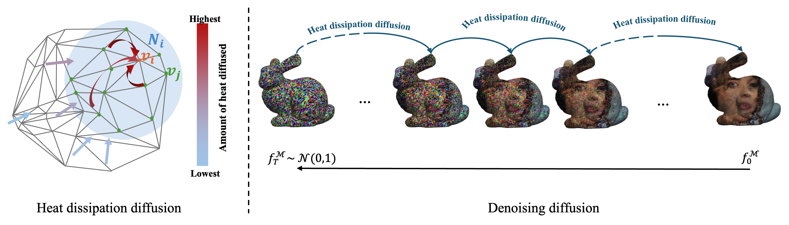

<div align="center">
<h1>DoubleDiffusion </h1>
<h3>Combining Heat Diffusion:fire: with Denoising Diffusion <br>  for Generative Learning on 3D Meshes</h3>


[](https://arxiv.org/abs/2501.03397)  [](https://opensource.org/licenses/MIT)

<a href="https://wxyxixixi.github.io/">Xuyang Wang</a>:kangaroo:, <a href="https://scholar.google.com/citations?user=1NIzHZcAAAAJ&hl=en">Ziang Cheng</a>:penguin:, <a href="https://zhyever.github.io/">Zhenyu Li</a>:camel:,  <a href="https://scholar.google.com.au/citations?user=xe6Uv3gAAAAJ&hl=en">Jiayu Yang</a>:penguin:, <br> <a href="https://scholar.google.com/citations?user=9BA3wgQAAAAJ&hl=en">Haorui Ji</a>:kangaroo:, <a href="https://panji530.github.io/">Pan Ji</a>:penguin:, <a href="https://sites.google.com/site/mehrtashharandi/">Mehrtash Harandi</a>:koala:,  <a href="https://scholar.google.com.au/citations?user=cHia5p0AAAAJ&hl=en">Richard Hartley</a>:kangaroo:,  <a href="https://users.cecs.anu.edu.au/~hongdong/">Hongdong Li</a>:kangaroo:. 
<br>The Australian National University :kangaroo:, Tencent XR Vision Labs :penguin:, KAUST :camel:, Monash University :koala:

<center>

</center>


</div>
This repository is the official implementation of the paper **DoubleDiffusion**. The codes performs the denoising diffusion directly on the 3D meshes to generate texture or image on the input 3D Meshes. The idea is simple to follow. This paper and the associated codes adapt the idea of denoising image for the image generation on to the 3D meshes. Textured 3D meshes are generated through a denoising diffusion specifically designed for the 3D meshes.

## Founctionbility
### Infer - texture generation on 3D Meshes with our chekpoint
Input the 3D meshes, texture can be generated through the inferring pipeline. 
<br>**Toy Checkpoint**<br>
This checkpoint is trained with different precisions of the 3D stanford bunny meshes, which are textured with Celeba-hq images. 
 


### Training - training to generate your own texture dataset


## Repo's structure
```
DoubleDiffusion/
├── data/
    ├─── object/
    ├─── image/
    ├─── preprocessed/
├── experiments/ # for storing the output results
├── lib/models/diffusion_net
├── scripts/ # for storing the training and inference scripts
├── src
    ├─── baselines # mdf codes
    ├─── ssdm # double diffusion codes (aka. simple spectral diffusion model; aka. our model)
├── train.py # for training the model
├── infer.py # for inferring the model
├── infer_baseline.py # for inferring the baseline model
├── infer_edm.py # for inferring doubld diffusion with edm pipeline
```
## Enviroment
```bash
conda create -n manifold python=3.8
conda activate manifold
```
```bash
# please make sure the torch version is compatible with the pytorch3d version, see https://github.com/facebookresearch/pytorch3d/blob/main/INSTALL.md for more details
pip install torch torchvision torchaudio
conda install pytorch3d -c pytorch3d
conda install numpy natsort tqdm networkx scikit-learn wandb
pip install potpourri3d pytorch3d pyvista robust-laplacian trimesh 
conda install -c conda-forge diffusers acceletor
```

## Preprocessing
The dataset is preprocessed when first time running the 'train.py' code. The logic is that the laplacian matrix and its eigen products are computed for each mesh when initialized the ManifoldDataLoader for the first time. The preprocessed data is stored in the `data/preprocessed` folder.


## Run the code
to run the training example on manfold bunny, please run the following command:
```bash
bash scripts/bunny/train_manifold_bunny.sh 
```

## Speed
### training speed
The speed is tested on a manifold bunny mesh with 52288 vertices.
| GPU | Batch Size | Time per Epoch | Iteration per Time|
|-----|------------|-------------------|-------------------|
| 2 * 3090 | <center>4</center> | <center>~37 mins</center> | <center>1.34 it/s</center>|

The speed is tested on a median bunny mesh with 2992 vertices.
| GPU | Batch Size | Time per Epoch | Iteration per Time|
|-----|------------|-------------------|-------------------|
| 2 * 3090 | <center>4</center> | <center>~2 mins</center> | <center>22.054 it/s</center>|

The speed is tested on a simple bunny mesh with 500 vertices.
| GPU | Batch Size | Time per Epoch | Iteration per Time|
|-----|------------|-------------------|-------------------|
| 2 * 3090 | <center>4</center> | <center>~2 mins</center> | <center>22.054 it/s</center>|

The speed is tested on a median bunny mesh with 35947 vertices.
| GPU | Batch Size | Time per Epoch | Iteration per Time|
|-----|------------|-------------------|-------------------|
| 2 * 3090 | <center>4</center> | <center>~2 mins</center> | <center>22.054 it/s</center>|


# citation
If you find this work useful in your research, please consider citing:

```bibtex
@article{wang2025doublediffusion,
  title={DoubleDiffusion: Combining Heat Diffusion with Denoising Diffusion for Generative Learning on 3D Meshes},
  author={Wang, Xuyang and Cheng, Ziang and Li, Zhenyu and Yang, Jiayu and Ji, Haorui and Ji, Pan and Harandi, Mehrtash and Hartley, Richard and Li, Hongdong},
  journal={arXiv preprint arXiv:2501.03397},
  year={2025}
}
```


